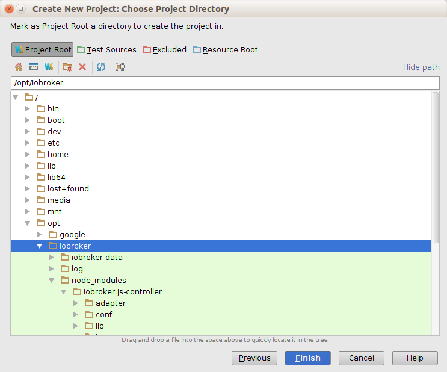
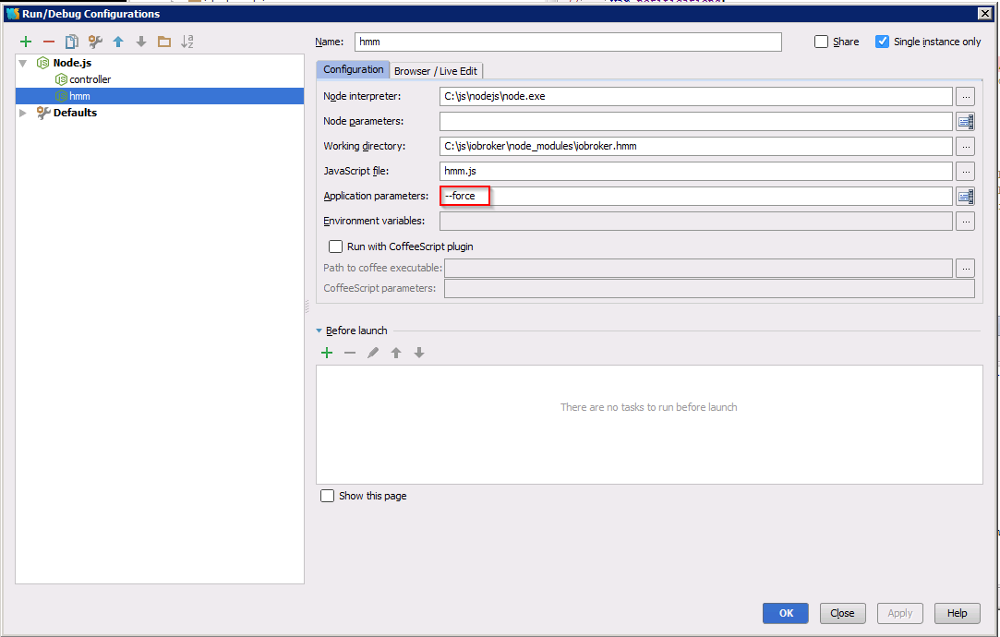

# 开发环境搭建 {docsify-ignore-all}

?> ***这是一个占位符***.
   <br><br>
   请您帮助ioBroker完善这篇文章。  
   请注意[ioBroker风格指南][]，
   这样可以更容易地合并您的提交。

此章节文档，我们将展示如何安装和设置ioBroker开发环境。
本文档主要介绍用WebStorm进行开发，Nodeclipse也是另一种选择，但是文档中并不介绍此IDE。
这个文档没有关于Javascript，NodeJS，HTML5等的解释。

欢迎扩展以下的信息。

## 在Ubuntu 14.04上下载并安装WebStorm

从[jetBrains][]网页下载适用于您操作系统的WebStorm。
本文档主要介绍在Ubuntu 14.04环境下的搭建。  
打开下载目录并使用如下命令安装`WebStorm`

```bash
sudo mv WebStorm-9.0.3.tar.gz /opt/
cd /opt/
sudo tar xvzf WebStorm-9.0.3.tar.gz
cd WebStorm-139.1112/bin
sudo ./webstorm.sh
```

**安装Java JDK**

```bash
sudo apt-add-repository ppa:webupd8team/java
sudo apt-get update
sudo apt-get install oracle-java8-installer
```

**安装NodeJS**

```bash
sudo apt-get install nodejs
sudo ln -s /usr/bin/nodejs /usr/bin/node
```

**安装NPM**

```bash
sudo apt-get install npm
```

## 下载最新版本的ioBroker源码并导入WebStorm项目

1. 打开终端并转到/opt目录。
2. 使用`mkdir iobroker`创建一个新目录，然后执行`cd iobroker`
3. 使用`npm install iobroker`安装iobroker
4. 使用`cd node_modules/iobroker.js-controller/`进入路径，
   更改*iobroker*文件权限`chmod +x iobroker`，
   然后输入`node controller.js`
5. 在浏览器访问`http://localhost:8081`，您应该看到ioBroker欢迎屏幕。
   
   *ioBroker欢迎界面*
6. 转到终端窗口，然后输入`ctrl + c`以停止iobroker

## 为ioBroker配置WebStorm运行和调试环境

1. 运行`./webstorm.sh`打开WebStorm项目
1. 单击`文件`->`从现有文件中新建项目`
1. 选择以下内容：  
   
1. 选择您的ioBroker根目录（在目录上单击鼠标右键以设置项目根目录）：  
   
1. 您的新WebStorm项目应该如下图所示：  
   

**创建“运行配置”ioBroker**

1. 转到`运行`->`编辑配置`  
   
1. 选择`+`并添加如下图所示的NodeJS配置  
   

## 如何从WebStorm启动ioBroker

1. 选择启动ioBroker  
   
2. 要停止ioBroker，在WebStorm中打开一个终端并输入  
   

## 如何调试ioBroker适配器

在本章中，我们将了解如何调试ioBroker Adapter，比如“iobroker.hmm”。  
首先启动ioBroker，如前所述，请不要使用“调试模式”。仅可使用ioBroker的“运行模式”。  
像这样从命令行安装像ioBroker.hmm这样的适配器  
  
配置WebStorm“调试设置”  
  
转到ioBroker网页`http://localhost:8081`并安装iobroker.hmm适配器：  
  
安装适配器后，我们必须禁用适配器实例  
  
下一步  
  
最后应该显示如下内容：  
  
现在回到WebStorm，打开hmm.js文件并设置一个像这样的断点：  
  
开始调试iobroker.hmm适配器：  
  
当您在第一个断点处停止时，您可以执行以下步骤：1）恢复程序2）跳到下一步：  
  

## 如何创建第一个自己的适配器

[ioBroker风格指南]: _zh-cn/community/styleguidedoc
[jetBrains]: https://www.jetbrains.com/webstorm/download/
