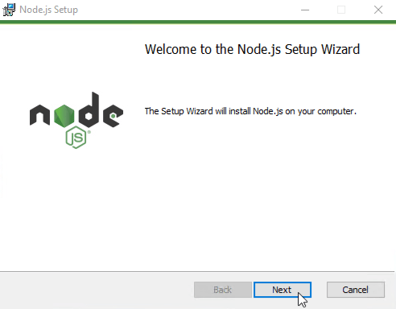

# 安装Node.js和npm

?> ***这是一个占位符***.
   <br><br>
   请您帮助ioBroker完善这篇文章。  
   请注意[ioBroker风格指南][]，
   这样可以更容易地合并您的提交。

ioBroker和适配器主要用JavaScript语言编写。
由于计算机无法直接运行Javascript，因此需要安装运行时环境*Node.js*。  
以下信息是[Node.js基金会][]安装说明的官方翻译。

## 详细内容

----------------------------

- [安装Node.js和npm](#%E5%AE%89%E8%A3%85nodejs%E5%92%8Cnpm)
  - [详细内容](#%E8%AF%A6%E7%BB%86%E5%86%85%E5%AE%B9)
  - [Android](#android)
  - [Arch Linux](#arch-linux)
  - [基于 Linux 的 Debian 和 Ubuntu 发行版, Enterprise Linux/Fedora 和 Snap packages](#%E5%9F%BA%E4%BA%8E-linux-%E7%9A%84-debian-%E5%92%8C-ubuntu-%E5%8F%91%E8%A1%8C%E7%89%88-enterprise-linuxfedora-%E5%92%8C-snap-packages)
  - [FreeBSD](#freebsd)
  - [Gentoo](#gentoo)
  - [NetBSD](#netbsd)
  - [nvm](#nvm)
  - [OpenBSD](#openbsd)
  - [openSUSE 以及 SLE](#opensuse-%E4%BB%A5%E5%8F%8A-sle)
  - [macOS](#macos)
    - [可替代方案](#%E5%8F%AF%E6%9B%BF%E4%BB%A3%E6%96%B9%E6%A1%88)
  - [SmartOS 和 illumos](#smartos-%E5%92%8C-illumos)
  - [Solus](#solus)
  - [Void Linux](#void-linux)
  - [Windows](#windows)
    - [可替代方案](#%E5%8F%AF%E6%9B%BF%E4%BB%A3%E6%96%B9%E6%A1%88-1)

----------------------------

## Android

因为 Android 版的 Nodejs 目前处于实验阶段，所以当下不提供预编译版本。

但是你有一些第三方的解决方案可供选择：
拿 [Termux][] 来说，它为安卓提供了终端模拟器和 Linux 环境，
以及内置的包管理器和 [可扩展应用集][]，其中包含了大量预编译的应用。
在 Termux 中，以下的命令将会安装最新版 Nodejs：

```bash
pkg install nodejs
pkg install nodejs-current
```

目前，Termux 的 Nodejs 二进制程序包是在没有检查器支持的情况下编译的，
并与 `system-icu` （依赖于 `libicu` 包）相关联。

## Arch Linux

Node.js 以及 npm 包管理器在社区库中可如下方式使用：

```bash
pacman -S nodejs npm
```

## 基于 Linux 的 Debian 和 Ubuntu 发行版, Enterprise Linux/Fedora 和 Snap packages

[Node.js 官方二进制发行版][] 由 NodeSource 提供。

## FreeBSD

可以通过 [www/node][] 获取最近的 Node.js。

通过 [pkg][] 安装二进制文件包：

```bash
pkg install node
```

或通过 [ports][] 进行构建。

```bash
cd /usr/ports/www/node && make install
```

## Gentoo

可以在 portage tree 中获得 Node.js：

```bash
emerge nodejs
```

## NetBSD

可以在 pkgsrc 目录树中获得 Node.js：

```bash
cd /usr/pkgsrc/lang/nodejs && make install
```

或者使用 pkgin 安装一个二进制文件包 (如果它支持你的系统)：

```bash
pkgin -y install nodejs
```

## nvm

nvm（Node 版本管理器）是一个用于管理多个已发布的 Node.js 不同版本的 bash 脚本。
它允许你执行诸如“安装”、“卸载”以及“版本切换”等诸多功能。
使用 [安装脚本][] 安装 nvm。

对于 Unix / OS X 系统，Node.js 从源代码构建，
并通过 [nvm][] 安装到你所期望的地方。

```bash
$ env VERSION=`python tools/getnodeversion.py` make install DESTDIR=`nvm_version_path v$VERSION` PREFIX=""
```

随后你可以通过 `nvm` 在“发布版本”和“从源代码构建版本”中选择。

举个例子，如果你的 Node.js 版本是 v8.0.0-pre：

```bash
$ nvm use 8
```

一旦官方发布了版本，并且你希望卸载从源代码编译的版本，可以这样做：

```bash
$ nvm uninstall 8
```

## OpenBSD

Node.js 也可以通过 ports 系统获取。

```bash
/usr/ports/lang/node
```

在 OpenBSD 上中使用[pkg_add][]：

```bash
pkg_add node
```

## openSUSE 以及 SLE

在以下安装包中，Node.js在以下主版本库中可用：

* **openSUSE Leap 42.2**: `nodejs4`
* **openSUSE Leap 42.3**: `nodejs4`, `nodejs6`
* **openSUSE Tumbleweed**: `nodejs4`, `nodejs6`, `nodejs8`
* **SUSE Linux Enterprise Server (SLES) 12**: `nodejs4`, `nodejs6`
  （“Web 和 Scripting 模块” [安装前必须添加][]。）

举个例子，在 openSUSE Leap 42.2 上安装 Node.js，用 root 角色运行命令：

```bash
zypper install nodejs4
```

## macOS

从 [nodejs.org][] 官网直接下载 [macOS Installer][]。

_如果你想用 bash 命令下载：_

```bash
curl "https://nodejs.org/dist/latest/node-${VERSION:-$(wget -qO- https://nodejs.org/dist/latest/ | sed -nE 's|.*>node-(.*)\.pkg</a>.*|\1|p')}.pkg" > "$HOME/Downloads/node-latest.pkg" && sudo installer -store -pkg "$HOME/Downloads/node-latest.pkg" -target "/"
```

### 可替代方案

使用 **[Homebrew][]**:

```bash
brew install node
```

使用 **[MacPorts][]**:

```bash
port install nodejs<major version>

# Example
port install nodejs7
```

使用 **[pkgsrc][]**:

安装二进制文件包：

```bash
pkgin -y install nodejs
```

或者通过 pkgsrc 手动构建：

```bash
cd pkgsrc/lang/nodejs && bmake install
```

## SmartOS 和 illumos

SmartOS 镜像随 pkgsrc 预装。在其它的 illumos 发布版中，先安装 **[pkgsrc][]**，
然后你可以正常安装二进制文件包：

```bash
pkgin -y install nodejs
```

或通过 pkgsrc 手动构建：

```bash
cd pkgsrc/lang/nodejs && bmake install
```

## Solus

在主版本库中，Solus 提供了 node.js。

```bash
sudo eopkg install nodejs
```

## Void Linux

在主版本库中 Void Linux 发布稳定的 node.js。

```bash
xbps-install -Sy nodejs
```

## Windows

1. 直接通过 [nodejs.org][] 下载 [Windows Installer][] 安装。
     
   *Download von Node.js*
2. 双击启动下载的Node.js安装程序。

 ?> 通常，下载的程序位于`Downloads`文件夹中，文件名大致为`node-<Version>.msi`。

3. 请勿更改配置，全部选择确认或下一步完成安装。

     
   *安装Node.js*


### 可替代方案

使用 **[Chocolatey][]**:

```bash
cinst nodejs
# or for full install with npm
cinst nodejs.install
```

使用 **[Scoop][]**:

```bash
scoop install nodejs
```

[ioBroker风格指南]: _zh-cn/community/styleguidedoc
[Node.js基金会]: https://nodejs.org/zh-cn/download/package-manager/
[Termux]: https://termux.com
[可扩展应用集]: https://github.com/termux/termux-packages
[Node.js 官方二进制发行版]: https://github.com/nodesource/distributions/blob/master/README.md
[www/node]: http://freshports.org/www/node
[pkg]: https://www.freebsd.org/cgi/man.cgi?pkg
[ports]: https://www.freebsd.org/cgi/man.cgi?ports
[安装脚本]: https://github.com/creationix/nvm#install-script
[nvm]: https://github.com/creationix/nvm
[pkg_add]: http://man.openbsd.org/OpenBSD-current/man1/pkg_add.1
[安装前必须添加]: https://www.suse.com/documentation/sles-12/book_sle_deployment/data/sec_add-ons_extensions.html
[nodejs.org]: https://nodejs.org
[macOS Installer]: https://nodejs.org/#download
[Homebrew]: http://brew.sh/
[MacPorts]: http://www.macports.org/
[pkgsrc]: https://pkgsrc.joyent.com/install-on-osx/
[Windows Installer]: https://nodejs.org/#download
[Chocolatey]: http://chocolatey.org
[Scoop]: http://scoop.sh/